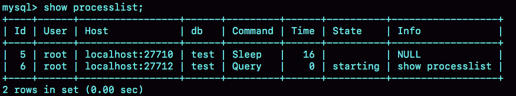

# MySQL基础架构：一条查询语句如何执行的？

示例：

假如有一张存储用户user信息的表。

```sql
select * from user where id = 10;
```

这是一条查询语句，指从表user 中查询出用户id为10的数据信息。

我们使用的MySQL，它是一个整体，根据其内部架构可拆分出很多组件。mysql基础架构图如下：


由图我们看以看出，MySQL分**Server层**和**存储引擎层**。

Server层包括：连接器、查询缓存、分析器、优化器、执行器等，涵盖了MySQL的大多数核心服务功能，以及所有的**内置函数**如（日期、时间、数学和加密函数等），所有跨存储引擎的功能都在这一层实现，比如**存储过程、触发器、视图**。

**存储引擎的作用：负责数据的存储和提取**。其架构模式是**插件式**的，支持InnoDB，MyISAM,Memory等多个存储引擎，现在使用最多的存储引擎是InnoDB，它从MySQL5.5.5版本开始成为了默认存储引擎。

因此，当我们在创建表时，若不指定其使用的存储引擎，默认使用的就是InnoDB。

那如何指定使用特定的存储引擎？例如：在create table 语句中使用engine = memory，指定使用内存引擎创建表。

不同的引擎共用一个MySQL的Server层。  

**不同的存储引擎，有着不一样的功能，有着各自的表数据存取方式** 。

## MySQL各组件作用

以开头的查询语句为例，分析各组件的作用。

### 1.连接器

第一步，我们要进行数据库连接，这时MySQL的连接器会发挥其作用：**跟客户端建立连接、获取权限、维持和管理连接**。

连接命令写法：

```shell
mysql -h$ip -P$port -u$user -p
```

输入完命令，在交互对话中，我们需输入密码，另外，该命令中-p后可跟着用户密码，但不建议这样写，因为会造成密码泄露，缺乏安全性。

示例：

linux 环境下连接mysql

```shell
[root@host]# mysql -u root -p
Enter password:******
```

在登录成功后会出现 mysql> 命令提示窗口，你可以在上面执行任何 SQL 语句。使用exit 命令退出mysql。

连接命令中的mysql是客户端工具，用来跟服务端建立连接。在完成经典的tcp握手后，连接器开始认证用户身份，这时认证使用

的是用户名和密码。

- 若用户名或密码不正确，交互对话中，会显示”Access denied for user“的错误，然后客户端程序结束执行。

- 若用户名和密码认证成功，连接器会到权限表中查询出用户拥有的权限。之后，这个连接里面的权限判断逻辑，都会依赖此时读到的权限。

  

  连接器是需要维持和管理连接的。这就意味着，一个用户成功建立连接，当你用管理员账号去修改该用户的权限，这不会影响该用户已经存在的连接，修改完成后，只有用户重新创建连接，连接器才会读取到该用户新的权限。

连接完成后，如何用户没有后续的操作，这个连接就处于**空闲状态**，如何查看连接状态：使用 show processlist 命令，其中Command列表示状态。”Sleep“ 表示空闲状态，”Query“ 表示查询状态。



若客户端太长时间没有动静，连接器会自动断开连接。这个时间参数由 wait_timeout 控制，默认是8小时。

如果连接被断开后，客户端再次发送请求的话，会收到一个错误提醒: Lost connection to MySQL server during query 。这时候如果你继续，就需要重连，然后再执行请求。

#### 什么是长连接和短连接？

数据库里，**长连接**是指成功连接后，如果客户段持续有请求，则一直使用同一个连接。**短连接**是指每次执行完很少的几次查询就断开连接，下次查询再创建连接。

全部使用长连接时，MySql占用的内存涨得很快，是**因为MySQL在执行过程中临时使用的内存是管理在连接对象里面的**。这些资源在连接断开的时候才释放。所以**如果过多的使用长连接，会导致内存占用量太大，被系统强行杀掉（OOM），从现象看就是MySQL异常重启了**。

#### 如何解决长连接带来的问题？

1. 定期断开长连接。使用一段时间，或者程序里面判断执行过一个占用内存的大查询后，断开连接，之后要查询再创建连接。

2. 如果你使用的MySQL5.7 或更高版本，可以在每次执行一个比较大的操作后，通过执行 **mysql_reset_connection** 来重新初始化连接资源。这个过程不需要重连和重新做权限验证，但是会将连接恢复到刚刚创建完时的状态。

### 2. 查询缓存（实现快速查找）

数据库连接完成后，我们可以执行 **select 查询语句**。执行逻辑来到了第二步：查询缓存。

#### 什么是查询缓存？

- MySQL获取到一个查询请求后，会先到查询缓存看看，之前是不是执行过这条查询语句。因为执行过的语句以及其结果，都会以key-value对的形式被直接缓存进内存里。key是查询语句，value是查询结果。若Mysql在查询缓存中找到了查询请求对应的key，则把value返回给客户端。
- 若在查询缓存中，Mysql找不到查询请求对应的key,就会继续执行后面的阶段（**是指分析器、优化器、执行器阶段**）

#### 为什么不建议使用查询缓存？

不建议使用查询缓存，是因为其利大于弊。

查询缓存发生**失效**的情况是非常频繁的，只要有对一张表的更新，这张表上的所有查询缓存都会失效，会被清空。这对更新压力大的表是非常不友好的。除非业务需要存在有一张**静态表**，如系统的配置表，在很长一段时间内不会发生表更新的操作，这些表的查询就很适用查询缓存。

- 若对于**默认的SQL语句都不使用查询缓存**的情况，我们可以将参数 **query_cache_type 设置成 DEMAND**。

- 对于需要**使用查询缓存的语句**，可以使用**SQL_CACHE**显示指定，如下语句

  ```sql
  select SQL_CACHE * from user where ID = 200;
  ```

### 3.分析器（词法分析、语法分析）

对于查询的请求语句，MySQL在查询缓存中找不到的话，就需要对SQL语句进行分析，分析出该语句需要做什么。

分析器会对语句进行**词法分析**，我们所写的**SQL语句是由多个字符串和多空格组成的**。分析器需要从字符串中识别出**表名、列名**。

接着，MySQL需要对语句进行**语法分析**。根据词法分析的结果，语法分析根据语法规则，判断你输入的SQL语句是否满足MySQL的语法。如果语句不对，就会收到”You  have  an error  in your SQL syntax“的错误提醒。

示例：

```shell

mysql> elect * from t where ID=1;

ERROR 1064 (42000): You have an error in your SQL syntax; check the manual that corresponds to your MySQL server version for the right syntax to use near 'elect * from t where ID=1' at line 1

```

可以看出，select 写错了，我们只需要关注错误提示中的 use near 就能快速定位出错的位置。

### 4.优化器（决定索引使用、表连接顺序、优化执行效率）

当SQL语句经过MySQL分析器 的词法分析和语法分析后，MySQL就知道该语句需要干什么。在开始执行之前，还需要经过优化器的处理。

- 在表存在多个索引的情况下，优化器可以决定使用哪个索引。
- 在一个语句存在多表关联（join）的时候，优化器可以决定各个表的连接顺序。

示例：

```sql
select * from t1 join t2 using(ID) where t1.c=10 and t2.b=20;
```

这条语句可分析出两种情况：

- 即可以先从t1表中取出所有c=10记录的ID值，再根据ID值关联到表t2，再判断t2里b的值是否等于20。
- 也可以先从表t2里取出b = 20 记录的ID值，再根据ID值关联到t1,再判断t1里的c值是否等于10。

这两种情况执行的逻辑结果都是一样，但执行效率不一样，优化器的左右就是决定选用哪一个方案。


### 5.执行器（对表操作权限验证、返回结果集）

MySQL通过分析器知道请求语句需要做什么，通过优化器知道怎么做，于是就进入执行器阶段，开始执行语句。

开始执行的时候，要先判断你是否有权限来对这个表执行查询，若没有，则会返回没有权限的错误。(在工程实现上，如果命中查询缓存，会在查询缓存返回结果的时候，做权限验证。**查询也会在优化器之前调用precheck验证权限**)。

```sql

mysql> select * from T where ID=10;

ERROR 1142 (42000): SELECT command denied to user 'b'@'localhost' for table 'T'
```

若有权限，则打开表继续执行。打开表时，执行器会根据表的引擎定义，去使用这个给引擎提供的接口。

例如，当我们表T中，ID字段没有索引，那么执行器的执行流程时这样的：

1. 调用 InnoDB引擎接口取这个表的第一行，判断ID值是不是10，如果不是则跳过，如果是则将这行存在结果集中；
2. 调用InnoDB引擎获取”下一行“，重复相同的判断逻辑，直到渠道这个表的最后一行。
3. 执行器将上述遍历过程中所有满足条件的行组成的记录集作为结果集返回给客户断。至此，语句执行完成。

对于有索引的表，执行的逻辑差不多。第一次调用的是”取满足条件的第一行“这个接口哦，之后循环取”满足条件的下一行“这个接口，这些接口都是引擎定义好的。

在**数据库慢查询日志**中看到一个**row_examined**的字段，表示这个语句执行过程，扫描了多少行。这个值就是在执行器每次调用引擎获取数据行时累加的。

在有些场景下，执行器调用一次，在引擎内部则扫描了多行，因此**引擎扫描行数跟rows_examined并不是完全相同的**。


