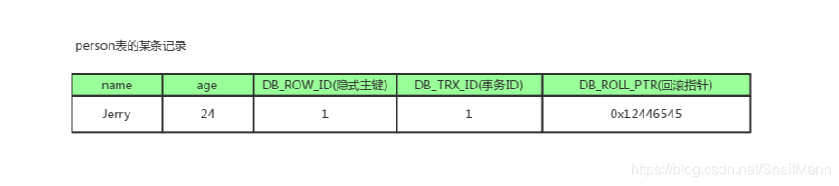
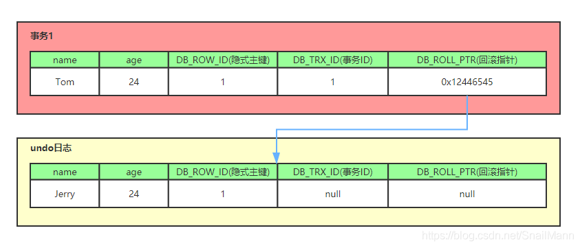
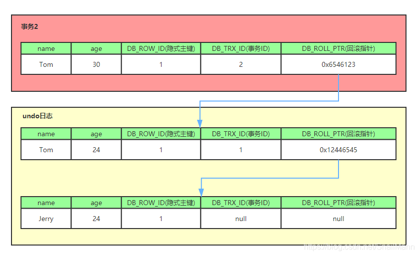

# 03 | 事务隔离：为什么你改的数据我看不到?

[极客时间-MySQL实战45讲-林晓斌](https://time.geekbang.org/column/article/68963)

经典的银行卡余额转账问题：

假如你账户余额有100元，现在你需要把所有的钱转账给小李，在这期间，数据库会发生查询、加减法等操作，假若你在账户余额还没被扣除前，重复执行了查询，再把钱转账给另外一个人，这样的场景对银行来说是无法接受的。所以，需要“事务”。

## 什么是事务？

- **事务就是保证一组数据库操作，要么全部成功，要么全部失败。在MySQL中，事务支持是由引擎层实现的**。
- 事务的特性：ACID，Atomicity（原子性）、Consistency（一致性）、Isolation（隔离性）、Durability（持久性）。
- **MySQL是一个支持多引擎的系统，但并不是所有的引擎都支持事务。比如：MySQL原生的MyISAM引擎**。这也是MyISAM被InnoDB引擎取代的原因之一。

以InnoDB为例，剖析MySQL在事务支持上的特定实现。


##  隔离性 和 隔离级别

### 为什么会产生隔离级别？

**在数据库上，存在多个事务同时执行时，就有可能出现脏读、不可重复读、幻读的问题**，为了解决这些问题，就有了隔离级别的概念。隔离的越严实，效率就越低。因此，我们需要在两者之间取得一个平衡点。


## SQL标准的事务隔离级别：

1. 读未提交 （read uncommitted）
2. 读提交 （read committed）
3. 可重复读 （repeatable read）
4. 串行化 （serializable）


- 读未提交是指：一个事务还没有提交前，它做的变更就能被别的事务看到。

- 读提交是指：一个事务在提交之后，它做的变更才会被别的事务看到。
- 可重复读是指：一个事务在执行过程中读取的数据，总是跟它启动时所读取到的数据是一致的。在可重复读的情况下，未提交的事务做的变更，其他事务是看不到的。
- 串行化是指：对于同一行记录，”读“ 加 ”读锁“，"写" 加 ”写锁“。当发生读写冲突时，后一个事务必须等前一个事务执行完成后，才能继续操作。


引用案例，对这几个隔离级别进行详细说明。假设数据表T中只有一列，其中一行的值为1，下面是按照时间顺序执行两个事务的行为。

```sql
create table T(c int) engine=InnoDB;

insert into T(c) values(1);
```


根据不同的隔离级别，分别对事务A中的v1 ,v2,v3的取值进行详细说明：

- 若隔离级别是**“读未提交”**：虽然事务B的还没有提交，但它做的变更对于A来说是可见的，所以 v1，v2, v3 的值都为 2。
- 若隔离级别是**”读提交“**：事务B对值1做变更后，这一变更需要提交之后才能对A可见，因此V1的值为1，v2和V3的值都是2.
- 若隔离级别是**”可重复读“**：V1,V2的值都是1。V3是2。在事务A没提交前，这一过程中，它读取的到数据总是跟它一开始读取的数据是一样的。
- 若隔离级别是**”串行化“**: 读加读锁，写加写锁。当事务B把1改为2时，会对这一行数据加锁，直到事务A执行完后，事务B才可以继续执行。所以V1，V2的值是1，V3的值是2。


## 在各种隔离级别下，视图是在什么时候创建的？

**在实现上，数据库里面会创建一个视图，访问的时候都是以视图的逻辑结果为准**

- 在”可重复读“隔离级别下，视图是在事务启动时创建的，整个事务存在期间都会用到这个视图。
- 在”读提交“隔离级别下，这个视图是在每个SQL语句开始执行的时候创建的。
- ”读未提交“没有视图概念，它是直接返回记录上的最新值。
- ”串行化”隔离级别下直接用加锁方式来避免并行访问。

不同隔离级别下，数据行为是有所不同的。Oracle数据库默认的隔离级别是“读提交”，MySQL数据库默认的隔离级别是“可重复读”。当我们把Oracle的数据迁移到MySQL时，需要把隔离级别设置成“读提交”。

## 如何配置数据库隔离级别？

配置的方式是，将启动参数transaction-isolation 的值设置成READ-COMMITTED （读提交）。可以使用show variables 查看当前值。

```sql
show variables like 'transaction_isolation'
```

每个隔离级别都有各自的使用场景。

例如，什么时候需要“可重复读”的场景？  ----核算账本、银行对账。


##  事务隔离的实现

以“可重复读”隔离级别为例，**在MySQL中，实际上每条记录在更新的时候都会同时记录一条回滚操作。**记录上的最新值，通过回滚操作，都可以得到前一个状态的值。

假设一值从1 被顺序改成2、3、4 在回滚日志里面有类似以下的记录：


当前值是4，但是在查询这条记录的时候，不同时刻启动的事务会有不同的read-view。如图中看到的，在视图A、B、C里面，这一记录的值分别是1、2、4。

**同一条记录在系统中可以存在多个版本，这就是数据库的多版本并发控制（MVCC）**。对于read-view A ，要得到1，就必须将当前值依次执行图中所有的回滚操作得到。此外，即使现在有另一个事务正在将4改成5，这个事务跟read-viewA,B,C对应的事务是不会冲突的。

系统会判断当前事务是否还需要这些回滚日志，当系统里没有比这个回滚日志更早的视图时，这个日志会被删除。


## 为什么不建议使用长事务？

长事务意味着系统存在很老的事务视图。由于这些事务随时可能访问数据库里面的任何数据，所以在这个事务提交之前，数据库里面它可能用到的回滚记录都必须保留，这会导致大量占用存储空间。

在MySQL5.5之前的版本，回滚日志是跟数据字典一起放在 ibdata 文件里的，即使长事务最终提交，回滚段被清理，文件也不会变小。例如 数据只用20GB，而回滚段有200GB的库，只好为了清理回滚段，重建整个库。

除了对回滚段的影响，长事务还占用锁资源，也可能拖垮整个库。

所以，我们需要尽量避免使用长事务。


## 事务的启动方式

MySQL的事务启动方式有以下几种：

1. 显示启动事务语句，begin 或 start transaction 。配套的提交语句是commit, 回滚语句是rollback。
2. set autocommit=0,这个命令会将这个线程的自动提交关掉。意味着如果你只执行一个select 语句，这个事务就启动了，而且并不会自动提交。这个事务持续存在直到你主动执行 commit 或 rollback 语句，或者断开连接。

有些客户段连接框架会默认连接成功后先执行一个set autocommit = 0 的命令。这就导致接下来的查询都在事务中，如果是长连接，就导致了意外的长事务。因此，建议使用 set autocommit = 1,通过显式语句的方式来启动事务。

对于一个需要频繁使用事务的业务，第二种方式每个事务在开始时都不需要主动执行一次“begin”，减少了语句的交互次数。

在 set autocommit = 1 的情况下，用begin 显示地启动事务，如果执行commit则提交事务。如果执行 commit work and chain，则是提交事务并自动启动下一个事务，这样也省去了再次执行begin语句地开销。同时带来的好处是从程序开发的角度明确地知道每个语句是否处于事务中。


## 如何查询数据库中的长事务？

可以在 information_schema 库的innodb_trx 这个表中查询长事务。如下语句，用来查找持续时间超过60s的事务。

```sql

select * from information_schema.innodb_trx where TIME_TO_SEC(timediff(now(),trx_started))>60
```


## 如何避免出现或处理长事务？

1. 在开发过程中，尽可能的减小事务范围，少用长事务，
2. 如果无法避免，需要保证逻辑日志空间足够用，并支持动态日志增长。
3. 监控Innodb_trx表，发现长事务就做报警处理。


## 知识扩展 MVCC

[正确理解MVCC](https://blog.csdn.net/SnailMann/article/details/94724197)

### 什么是MVCC?

- MVCC ，全称Muti-Version Concurrency Control。即多版本并发控制。MVCC是一种并发控制的方法，一般在数据库管理系统中，实现对数据库的**并发访问**，在编程语言中实现**事务内存**。

- MVCC在MySQL 的InnoDB引擎中的实现主要是为了**提高了数据库的并发性能**，用更好的方式去**处理读写冲突**，也能做到**不加锁，允许非阻塞并发读，在写操作进行时只锁定必要的记录**。


### 什么是当前读 和 快照读？

MySQL ，InnoDB下的当前读和快照读：

- 当前读

  像**共享锁（select lock in share mode），排他锁（select for update;update,insert,delete）**这些操作都是一种当前读。**当前读是指它读取的是记录的最新版本，读取时还要保证其他并发事务不能修改当前记录，会对读取的记录进行加锁**。

- 快照读

  **像不加锁的select操作就是快照读，即不加锁的非阻塞读**；快照读的前提是**隔离级别不是串行化**，串行级别下的快照读会退化成当前读；之所以出现快照读的情况，是基于提高并发性能的考虑，快照读的实现是基于多版本并发控制，即MVCC，可以认为MVCC是行锁的一个变种，但它在很多情况下，避免了加锁操作，降低了开销；既然是基于多版本，即**快照读可能读到的并不一定是数据的最新版本，而有可能是之前的历史版本。**

说白了，**MVCC就是为了实现读-写冲突不加锁，而这个读指的是快照读，而非当前读，当前读实际上是一种加锁的操作，是悲观锁的实现**。


### 当前读和快照读与MVCC的关系？

- 准确的说，MVCC多版本并发控制是指**“维护一个数据的多个版本，使得读-写操作没有冲突”**这一概念。仅仅是一个理想的概念。
- 而在MySQL中，实现这么一个MVCC理想概念，**我们需要MySQL提供具体的功能去实现它，而快照读就是MySQL为我们实现MVCC理想模型的其中一个具体非阻塞读功能**。而相对而言，当前读就是悲观锁的具体功能实现。
- MVCC模型在MySQL中的具体实现，则是由**3个隐式字段，undo日志，Read View等。**去完成的，具体需要看MVCC的实现原理。

###  MVCC的作用和好处？

数据库的并发场景有三种，分别为：

- 读-读：不存在任何问题，也不需要并发控制。
- 读-写：有线程安全问题，可能会造成事务隔离性问题，可能遇到脏读、幻读、不可重复读。
- 写-写：有线程安全问题，可能会存在更新丢失问题，比如第一类跟新丢失，第二类更新丢失。

MVCC带来的好处是？

多版本并发控制（MVCC）是一种用来解决**读-写冲突的无锁并发控制**，也就是为事务分配单向增长的时间戳，为每个修改保存一个版本，版本与事务时间戳关联，读操作只读该事务开始前的数据库的快照。所以MVCC可以为数据库解决以下问题：

- 在并发读写数据库时，可以做到在读操作时不用阻塞写操作，写操作不用阻塞读操作，提高了数据库并发读写的性能。
- 同时还可以解决脏读、幻读，不可重复读等事务隔离问题，但不能解决更新丢失问题

####  MVCC小总结

总之,MVCC就是因为大佬们不满意只让数据库采用悲观锁这样性能不佳的形式去解决读写冲突问题，而提出的解决方案。

所以，**在数据库中，我们有两种组合：**

- MVCC + 悲观锁

  MVCC解决读写冲突，悲观锁解决写写冲突。

- MVCC + 乐观锁

  MVCC解决读写冲突，乐观锁解决写写冲突。

这两种组合大大地提高了数据库并发性能，并解决了读写冲突、写写冲突导致的问题。

# MVCC实现原理

MVCC就是多版本并发控制，在数据中的实现，就是为了解决读写冲突，它的实现原理主要是依赖记录中的**3个隐式字段、undo日志、Read View**来实现的。

## 一、3个隐私字段

每行记录除了我们自定好的字段外，还有数据库隐 式定义的**DB_TRX_ID, DB_ROLL_PTR,DB_ROW_ID**等字段

- DB_TRX_ID

  6byte，最近修改（修改/插入）事务ID：记录创建这条记录/最后一次修改该记录的事务ID

- DB_ROLL_PTR

    7byte，回滚指针，指向这条记录的上一版本（存储于rollback segment里）

- DB_ROW_ID

  6byte，隐含的自增ID（隐藏主键），如果数据表没有主键，InnoDB会自动以DB_ROE_ID产生一个聚簇索引。

- 实际还有一个删除flag隐藏字段，既记录被更新或删除并代表真的删除，而是删除flag变了。



如上图，DB_ROW_ID是数据库默认为该行记录生成的唯一隐式主键，DB_TRX_ID是当前操作记录的事务ID，DB_ROLL_PTR是一个回滚指针，用于配合undo日志，指向上一个旧版本。


## 二、undo日志

undo log主要分两种：

- insert undo log

  代表事务在insert新记录时产生的undo log ，只在事务回滚时需要，并且在事务提交后可以被立刻丢弃。

- update undo log

  事务在进行update 或 delete时产生的undo log；不仅在事务回滚时需要，在快照读时也需要；所以不能随便删除，只有在快照读或事务回滚不涉及该日志时，对应的日志才会被 purge线程统一删除。

### MVCC的purge线程

- 从前面的分析可以看出，为了实现InnoDB的MVCC机制，更新或者删除操作都知识设置以下老记录的deleted_bit，并不是真正将过时的记录删除。
- 为了节省磁盘空间，InnoDB有专门的purge线程来清理deleted_bit为true的记录。为了不影响MVCC的正常工作，purge线程自己也维护了一个read_view(这个read_view 相当于系统中最老活跃事务的read_view)；如果某个记录的deleted_bit为true,并且 DB_TRX_ID相对于purge 线程的read view可见，那么这条记录一定时可以被安全清除的。


对MVCC有帮助的实质是 update undo log ，undo log实际是存在 rollback segment 中旧记录链，它的执行流程如下：

1. 比如一事务往persion 表里插入了一条新记录，**记录如下，`name`为Jerry, `age`为24岁，`隐式主键`是1，`事务ID`和`回滚指针`，我们假设为NULL**

2. **现在来了一个`事务1`对该记录的`name`做出了修改，改为Tom**

   - 在`事务1`修改该行(记录)数据时，数据库会先对该行加`排他锁`

   - 然后把该行数据拷贝到`undo log`中，作为旧记录，既在`undo log`中有当前行的拷贝副本

   - 拷贝完毕后，修改该行`name`为Tom，并且修改隐藏字段的事务ID为当前`事务1`的ID, 我们默认从`1`开始，之后递增，回滚指针指向拷贝到`undo log`的副本记录，既表示我的上一个版本就是它

   - 事务提交后，释放锁

     

3. **又来了个`事务2`修改`person表`的同一个记录，将`age`修改为30岁**

   - 在`事务2`修改该行数据时，数据库也先为该行加锁
   - 然后把该行数据拷贝到`undo log`中，作为旧记录，发现该行记录已经有`undo log`了，那么最新的旧数据作为链表的表头，插在该行记录的`undo log`最前面
   - 修改该行`age`为30岁，并且修改隐藏字段的事务ID为当前`事务2`的ID, 那就是`2`，回滚指针指向刚刚拷贝到`undo log`的副本记录
   - 事务提交，释放锁



从上面，我们就可以看出，不同事务或者相同事务对同一记录的修改，会导致该记录的`undo log`成为一条记录版本线性表，即链表，`undo log`的链首就是最新的旧记录，链尾就是最早的旧记录。（**当然就像之前说的该undo log的节点可能是会purge线程清除掉，向图中的第一条insert undo log，其实在事务提交之后可能就被删除丢失了，不过这里为了演示，所以还放在这里**）


## 三、Read View （读视图）

### 什么是read view?

Read View 就是事务进行`快照读`操作的时候生产的`读视图`（Read View），在该事务执行的快照读的那一刻，会生成数据库系统当前的一个快照，记录并维护系统当前活跃事务的ID。（当每个事务开启时，都会被分配一个ID，这个ID时递增的，所以最新的事务，ID值越大）。

所以我们知道`Read View`主要时用来做可见性判断的，即当我们某个事务执行快照读的时候，对该记录创建一个`Read View`读视图，把它比作条件用来判断当前事务能够看到哪个版本的数据，即可能是最新的版本，也可能是该行记录的`undo log`里面的某个版本的数据。

`Read View`遵循一个可见性算法，只要是将`要被修改的数据`的最新记录中的DB_TRX_ID（即当前事务ID）取出来，与系统当前其他活跃事务的ID做对比（由Read View维护），如果DB_TRX_ID跟Read View的属性做了某些比较，不符合可见性，那就通过DB_ROLL_PTR回滚指针取取出`undo log`中的DB_TRX_ID再比较，即遍历链表的DB_TRX_ID （从链首到链尾，即从最近的一次修改查起），直到找到满足特定条件的`DB_TRX_ID`,那么这个DB_TRX_ID所在的旧记录就是当前事务能看到的最新`老版本`。


# MVCC相关问题

## RR是如何在RC级的基础上解决不可重复读的？

当前读和快照读在RR级别下的区别：

`表1：`

| 事务A                       | 事务B                                      |
| --------------------------- | ------------------------------------------ |
| 开启事务                    | 开启事务                                   |
| 快照读(无影响)查询金额为500 | 快照读查询金额为500                        |
| 更新金额为400               |                                            |
| 提交事务                    |                                            |
|                             | select `快照读`金额为500                   |
|                             | select lock in share mode`当前读`金额为400 |

在上表的顺序下，事务B的在事务A提交修改后的快照读是旧版本数据，而当前读是实时新数据400

`表2：`

| 事务A                         | 事务B                                      |
| ----------------------------- | ------------------------------------------ |
| 开启事务                      | 开启事务                                   |
| 快照读（无影响）查询金额为500 |                                            |
| 更新金额为400                 |                                            |
| 提交事务                      |                                            |
|                               | select `快照读`金额为400                   |
|                               | select lock in share mode`当前读`金额为400 |

而在`表2`这里的顺序中，事务B在事务A提交后的快照读和当前读都是实时的新数据400，这是为什么呢？

- 这里与上表的唯一区别仅仅是`表1`的事务B在事务A修改金额前`快照读`过一次金额数据，而`表2`的事务B在事务A修改金额前没有进行过快照读。

**所以我们知道事务中快照读的结果是非常依赖该事务首次出现快照读的地方，即某个事务中首次出现快照读的地方非常关键，它有决定该事务后续快照读结果的能力**

**我们这里测试的是`更新`，同时`删除`和`更新`也是一样的，如果事务B的快照读是在事务A操作之后进行的，事务B的快照读也是能读取到最新的数据的**


##  RC,RR级别下的InnoDB快照读有什么不同

正是`Read View`生成时机的不同，从而造成RC,RR级别下快照读的结果的不同

- 在RR级别下的某个事务的对某条记录的第一次快照读会创建一个快照及Read View, 将当前系统活跃的其他事务记录起来，此后在调用快照读的时候，还是使用的是同一个Read View，所以只要当前事务在其他事务提交更新之前使用过快照读，那么之后的快照读使用的都是同一个Read View，所以对之后的修改不可见；
- 即RR级别下，快照读生成Read View时，Read View会记录此时所有其他活动事务的快照，这些事务的修改对于当前事务都是不可见的。而早于Read View创建的事务所做的修改均是可见
- 而在RC级别下的，事务中，每次快照读都会新生成一个快照和Read View, 这就是我们在RC级别下的事务中可以看到别的事务提交的更新的原因

**总之在RC隔离级别下，是每个快照读都会生成并获取最新的Read View；而在RR隔离级别下，则是同一个事务中的第一个快照读才会创建Read View, 之后的快照读获取的都是同一个Read View。**

