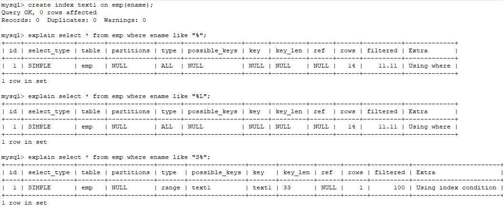
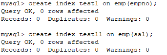
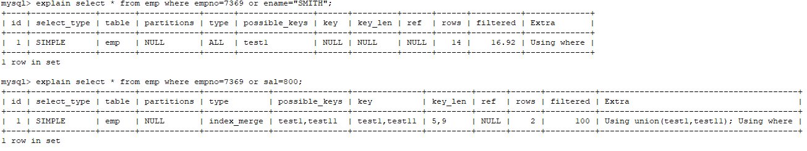
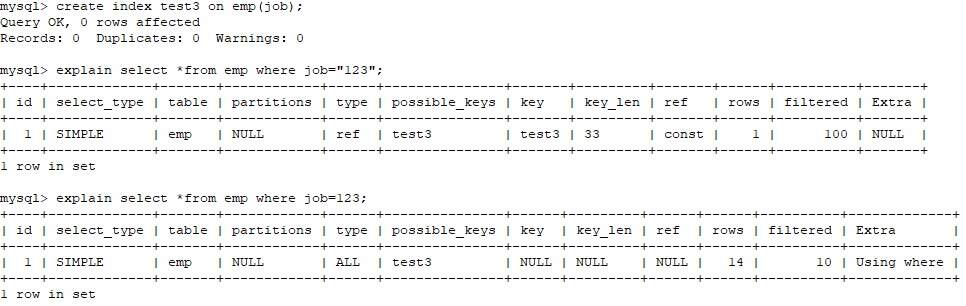
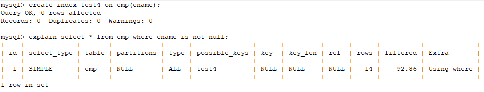
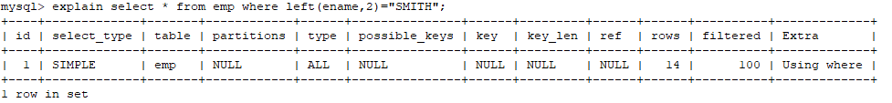

# 索引创建

**普通索引创建方式：**

```sql
CREATE INDEX (自定义)索引名 ON 数据表(字段);
```

**联合索引创建方式：**

```sql
CREATE INDEX (自定义)索引名 ON 数据表(字段_1,字段_2,...)
```

**查看索引：**

```sql
SHOW INDEX FROM 数据表名
```

**删除索引：**

```sql
DROP INDEX 索引名;
```

**explain解析select语句：**

以下通过`explain`显示出Mysql执行的字段内容：

- id : SELECT 查询的标识符；每个SELECT都会自动分配一个唯一的标识符。
- select_type : SELECT 查询的类型
- table : 查询的是哪个表
- partitions ：匹配的分区
- type ：join类型
- **possible_keys：此次查询中可能选用的索引**

- **key : 此次查询中确切使用到的索引**
- ref : 哪个字段或常数与 key 一起被使用
- rows : 显示此查询一共扫描了多少行，这是个估计值
- filtered : 表示此查询条件所过滤的数据的百分比
- extra : 额外的信息


# 索引优化

##  索引覆盖

1、覆盖索引：如果查询条件使用的是普通索引（或是联合索引的最左原则字段），查询结果仅是联合索引的字段或是主键，不用回表操作，直接返回结果，减少IO磁盘读写读取正行数据。

## 最左前缀

 2、最左前缀：联合索引的最左 N 个字段，也可以是字符串索引的最左 M 个字符 

## 联合索引

3、联合索引：根据创建联合索引的顺序，以最左原则进行where检索，比如（age，name）以age=1 或 age= 1 and  name=‘张三’可以使用索引，单以name=‘张三’ 不会使用索引，考虑到存储空间的问题，还请根据业务需求，将查找频繁的数据进行靠左创建索引。 

## 索引下推

4、索引下推：like 'hello%’and age >10  检索，MySQL5.6版本之前，会对匹配的数据进行回表查询。5.6版本后，会先过滤掉age<10的数据，再进行回表查询，减少回表率，提升检索速度


# 索引失效的场景

1. like 以 % 开头，索引无效；当like前缀没有%，后有%时，索引有效。



2. or 语句前后没有同时使用索引。当or左右查询字段只有一个是索引，该索引失效，只用当or左右查询字段均为索引时，才会生效。






3. 联合索引，不是使用第一列索引字段，索引失效

   

4. 数据类型出现隐式转化。如`varchar`不加单引号的话可能会自动转换成`int`类型，使用索引无效，产生全表扫描。

   

5. 在索引列上使用`IS NULL` 或`IS NOT NULL`、`!=`操作，**可能会使索引失效**。索引是非空的。如：数字类型，判断大于0；字符串类型设置一个默认值，判断是否等于默认值。

   

    注意：在MySQL中,WHERE子句中使用`IS NULL`,`IS NOT NULL` ,`!=`  不一定会使索引失效。仍然会使用索引，本质上都是优化器去计算一下对应的二级索引数量占所有记录数量的比值而已。参考地址：https://mp.weixin.qq.com/s/CEJFsDBizdl0SvugGX7UmQ

6. 在索引字段上使用`not`,`<>`。优化方法： key<>0 改为 key>0 or key<0。

7. 在索引字段上进行计算操作、字段上使用函数。

   

8. 当全表扫描速度比索引速度快时，mysql会使用全表扫描，此时索引会失效。

